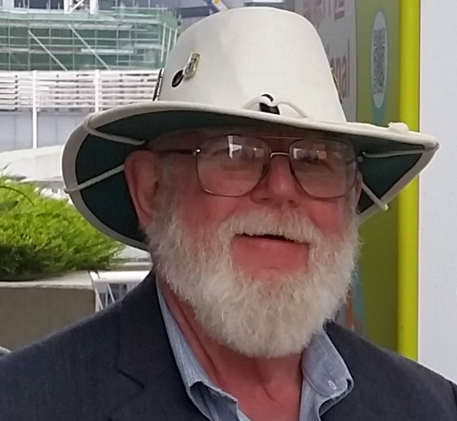

:page-liquid:

== The passing of Dave Thewlis on June 17, 2025

On June 17th,  Dave Thewlis, Calconnect’s founding executive Director, passed away after a long illness. He was 82 years old.

Dave retired from Calconnect in January 2023, serving just short of 20 years. At CalConnect XXXII, our Tenth Anniversary Meeting hosted by Kerio Technologies in San Jose, California, Dave Thewlis was honored as the 7th recipient of the CalConnect  Distinguished Service Award.

David was born in October of 1942 to John and Beth Thewlis, in Columbus, Ohio.
After high school, he joined the Air Force and went through training and classes to learn Russian. He then spent about 2 years posted in Berlin, Germany.

After he left the Air Force he moved to the San Francisco Bay area in 1964, where he was a founder of the Society for Creative Anachronism (SCA) which now has chapters and members worldwide, and where his personal influence and ideas contributed significantly to their charter values and ideas. The society was the inspiration for referring to CalConnect member meetings as “Round Tables”. https://history.westkingdom.org/Who/memoriam.php?namecode=1142[The SCA in memoriam page for Dave is here]

During his career in IT management at Kaiser Permanente Health Care, Dave served as Chief Standards Officer for SHARE, the IBM Users Group founded in the mid 1950’s. Through SHARE Dave met Pamela Taylor, and Patricia Egen, then co-chair of IETF CALSCH, a working group developing interoperable standards, who saw the need for a calendaring and scheduling consortium. In 2003, Pat recruited Dave to help start the Consortium, and to serve as Executive Director, with Pam, Pat, and Dave as founding board members.

Dave’s organizational and administrative contributions to CalConnect during his long tenure are truly immeasurable. Fostering collaboration among top-tier contributors can be challenging, but the CalConnect value proposition of creating mutual advantage for erstwhile competitors through development of open, interoperable C&S standards in an atmosphere of collegial cooperation is inculcated throughout the organization. CalConnect is a true meritocracy; anyone, irrespective of membership category or company affiliation, can become a CalConnect thought leader, technical leader, or organizational leader, based on the depth of their participation, and the quality of contributions.

Dave’s management persona allowed him to understand the technologists without competing with them, to converge on consensus expeditiously, through patience and encouragement, to provide the foremost forum to discuss and debate C&S standards and futures, and to produce standards which provide value to not only vendors, but also to the end-users of their products. Dave set the tone of civility and cooperation for the consortium, working tirelessly for the membership, valuing the contributions of all the members, and fostering an atmosphere encouraging new and prospective members to feel welcome, and to actively engage in consortium activities.

One of our members, at the time of Dave’s retirement, captured the feelings of virtually all of CalConnect, “The in-person, 3-times a year, CalConnect conferences were always a highlight of my professional life, with a chance to meet everyone and have more intense sessions of testing and standards design. Dave was always there managing the meeting and providing the support everyone needed to accomplish our goals. The whole Calendaring community owes Dave a great debt of gratitude for all his hard work and contributions over the years, and I personally offer my sincere thanks for the many enjoyable times we had.”

=== Community Comments

If you'd like to include a comment for Dave on this page, please email
mailto:mike.douglass@calconnect.org?subject=Comment%20for%20Dave%20Thewlis%20passing[mike.douglass@calconnect.org].